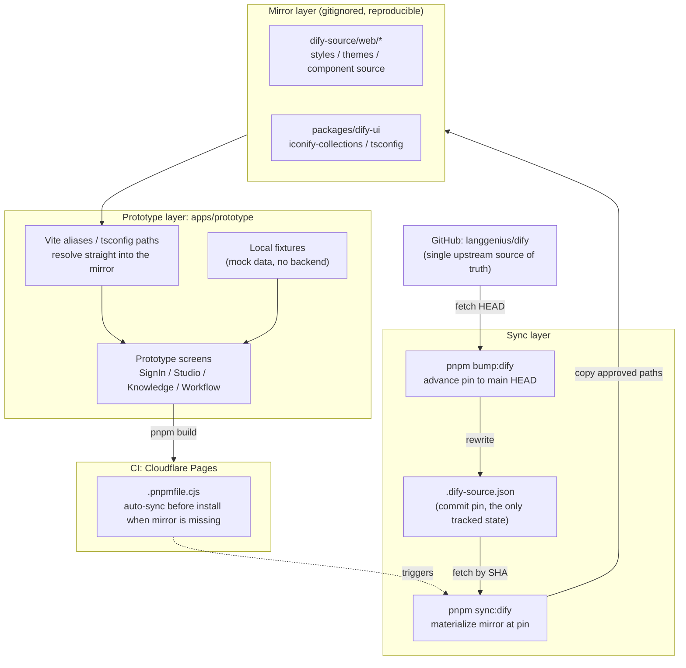

# Dify Prototype

Source-faithful Dify frontend prototype workspace.

Setup after clone:

```bash
pnpm install
```

If the Dify mirror (`dify-source/`, synced `packages/*`) is missing, `.pnpmfile.cjs` materializes it automatically before dependency resolution by running `pnpm sync:dify`. The mirror is gitignored and fully reproducible from the commit pinned in `.dify-source.json`; run `pnpm sync:dify` manually whenever you need to restore it.

To advance the pin to the latest upstream `main`:

```bash
pnpm bump:dify
```

This rewrites the pin in `.dify-source.json` (a one-line diff) and re-materializes the mirror. Upstream is `https://github.com/langgenius/dify.git`.

Synced source is the visual authority. Prototype code should reuse Dify tokens, primitives, icons, assets, and page/component structure instead of inventing styles.

## Architecture

Git tracks only the pin and the prototype code; the mirror is always a derived artifact of the pin. Locally it is maintained by the `sync`/`bump` commands, and CI self-heals through `.pnpmfile.cjs`.


