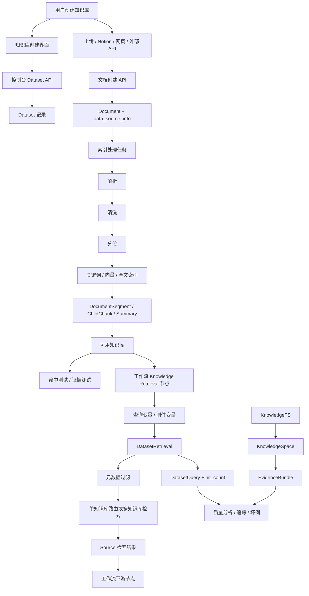

# 04. 用户故事地图与信息流

## 完整用户故事地图

| 阶段 | 用户动作 | 界面职责 | 后端/系统逻辑 | 产品经理必须定义的问题 |
|---|---|---|---|---|
| 创建知识库 | 填写名称、描述、权限，选择创建方式 | 展示创建入口和类型差异 | 创建 `Dataset` 记录 | 用户创建它是为了问答、工作流检索、外部知识连接，还是多模态知识？ |
| 添加数据源 | 上传文件、连接 Notion、抓取网页、连接外部知识 API | 数据源选择、授权、上传队列、失败提示 | 生成文档或外部知识配置，保存 `data_source_info` | 失败、重复、权限不足、外部连接不可用时给用户什么下一步？ |
| 配置处理规则 | 选择分段、索引方式、检索方式、元数据 | 分步配置，不暴露底层实现噪音 | 创建处理规则，估算分段和索引成本 | 哪些复杂度在创建时出现，哪些放到后续工作台？ |
| 处理与索引 | 启动解析、清洗、分段、索引 | 显示阶段进度、可重试状态和错误详情 | 文档状态从 waiting 到 completed/error/paused 流转 | 哪些阶段支持取消、重试、恢复？错误是否面向用户可理解？ |
| 变为可用 | 查看文档是否可被检索 | 展示 available、disabled、archived、failed 等状态 | 根据文档索引状态、启用状态、归档状态推导可用性 | 每个状态应该提供哪些行动按钮？ |
| 维护内容 | 禁用、归档、重命名、更新元数据、替换文档 | 批量操作、详情页、元数据编辑 | 更新 `Document` 字段和 `DatasetMetadata` | 内容变化对已接入的工作流有什么影响？是否需要提示重建索引？ |
| 测试检索 | 输入查询，调整检索参数，查看命中文档 | 命中测试或证据测试界面 | 调用检索服务，记录 `DatasetQuery` | 用户如何判断“为什么命中/为什么没命中”？ |
| 连接工作流 | 在 Knowledge Retrieval 节点选择知识库和变量 | 知识库选择、查询变量、附件变量、检索配置、元数据过滤 | 运行时解析变量并调用 `DatasetRetrieval` | 哪些字段必填，哪些参数组合非法，非法时如何前置阻断？ |
| 工作流运行消费 | 工作流节点执行，后续节点读取检索结果 | 明确输出变量结构 | 返回 `Source` 数组，包含内容、标题、URL、元数据、文件等 | 下游节点是否能理解结果形态？是否需要证据模式输出？ |
| 评估质量 | 查看坏例、追踪、黄金问题、回答质量 | 质量页、追踪页、评估集 | 记录 `AnswerTrace`、`BadCase`、`GoldenQuestion` 等质量资产 | 团队如何持续改进 RAG，而不是一次性导入后失控？ |
| 系统维护 | 重建索引、修复数据源、清理存储、健康检查 | 管理员入口和安全操作确认 | 重试任务、重建索引、保留策略、清理过期对象 | 哪些是普通构建者可见，哪些必须是管理员能力？ |

## 信息流图

## 维护任务

Dataset 2.0 不应只把“维护”理解为文档增删改查，而应该组织成用户能理解的任务：

- 更新内容：新增、替换、删除、禁用、归档文档。
- 修复数据源：授权失效、网页抓取失败、外部 API 不可用、同步中断。
- 重建索引：分段策略、解析器、Embedding 模型、索引投影变化后重新生成可检索资产。
- 改进检索：补充元数据、调整检索模式、调整重排、沉淀黄金问题和坏例。
- 控制成本：查看数据源规模、索引规模、重建成本、保留策略和清理任务。
- 保证运行时稳定：在工作流使用前明确哪些知识库可用、哪些不可用、哪些会降级。

## 产品边界

产品经理必须定义并持续维护：

- 用户能看懂的状态命名。
- 每个状态下的可行动作。
- 字段必填、条件必填、非法组合和错误提示。
- 创建流、工作台、工作流节点之间的职责分配。
- 检索默认值、推荐值和风险提示。
- 元数据过滤的用户语义。
- 命中测试升级为证据测试后的用户价值。
- 工作流输出结构的可解释性。
- RAG 质量闭环。

普通用户界面不应直接暴露：

- 对象存储 key。
- 底层解析产物 schema。
- 原始索引投影 fingerprint。
- 原始 lease 模型。
- 原始 fsck 枚举。
- 底层 GC 队列和存储清理细节。
